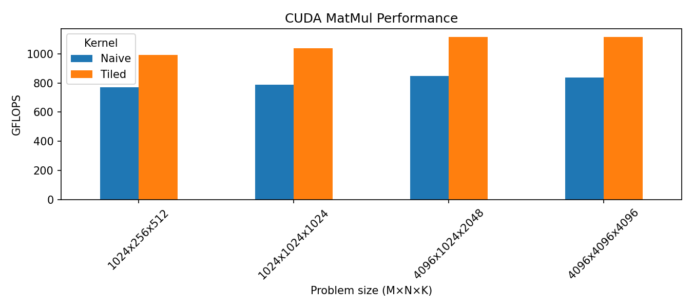

# CUDA-Custom-Kernels

My CUDA playground to learn by writing some custom kernels, time them, and plot the results on RTX 3060.

## Layout
- `src/vec_add.cu` – 1D vector add (one thread per element)
- `src/matmul.cu` – matrix multiply
  - `matmul_naive` (global memory only)
  - `matmul_tiled` (shared memory tiling)
- `src/main.cu` – simple harness with CUDA events; dumps `scripts/results.csv`
- `scripts/plot_perf.py` – reads CSV and saves `scripts/perf.png`

## Build (nvcc)
Tested on RTX 3060, CUDA 12.x:

```bash
nvcc -O3 -arch=sm_86 -o bin/kernels   src/main.cu src/matmul.cu src/vec_add.cu
```

(Adjust `-arch` to your GPU if needed.)

## Run
```bash
./bin/kernels
```

This warms up, times each kernel, prints the best time, and appends to `scripts/results.csv`.

Set matrix sizes in `src/main.cu`.

## Plot
Install once:
```bash
pip install pandas matplotlib
```

Then:
```bash
python3 scripts/plot_perf.py
```
Output goes to `scripts/perf.png`.

## Example results (from my 3060)
`scripts/results.csv` (best time over a few runs):



```
name,M,N,K,time,GFLOPS
Naive,1024,256,512,0.348192,770.941
Tiled,1024,256,512,0.270336,992.97
Naive,1024,1024,1024,2.72998,786.629
Tiled,1024,1024,1024,2.0695,1037.68
Naive,4096,1024,2048,20.2281,849.307
Tiled,4096,1024,2048,15.4309,1113.34
Naive,4096,4096,4096,163.842,838.851
Tiled,4096,4096,4096,123.207,1115.51
```

Tiled > Naive because of shared memory and coalesced loads.

## Profiling
Run this:
```bash
sudo /usr/local/cuda/bin/ncu --set full --section LaunchStats --section Occupancy ./bin/kernels
```
